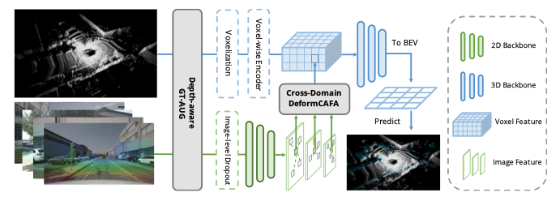

## AutoAlignV2

> Deformable Feature Aggregation for Dynamic Multi-Modal 3D Object Detection

## Note

The code is released without rechecking. We will clean up and recheck the code recently.

<center>

</center>

## Get Started

### Prepare Dataset
```
python tools/create_data.py nuscenes --root-path ./data/nuscenes --out-dir ./data/nuscenes --extra-tag nuscenes --version v1.0
```

### Train Model
```
./tools/dist_train.sh aav2_cfg/centerpoint_voxel_nus_8subset_bs4_img1_nuimg_detach_deform_multipts.py 8
```

### Test Model
```
./tools/dist_test.sh aav2_cfg/centerpoint_voxel_nus_8subset_bs4_img1_nuimg_detach_deform_multipts.py work_dirs/centerpoint_voxel_nus_8subset_bs4_img1_nuimg_detach_deform_multipts/epoch_20.pth 8 --eval bbox
```

## Performance

### Nuscenes Test Leaderboard
| Model | mAP | NDS |
| -|-|-|
| AutoAlign |  65.8  |  70.9  |
| AutoAlignV2 | 68.4 | 72.4|


## Citation
If you find our work useful for your research, please consider citing the paper
```
@article{chen2022autoalignv2,
  title={AutoAlignV2: Deformable Feature Aggregation for Dynamic Multi-Modal 3D Object Detection},
  author={Chen, Zehui and Li, Zhenyu and Zhang, Shiquan and Fang, Liangji and Jiang, Qinhong and Zhao, Feng},
  journal={ECCV},
  year={2022}
}
```